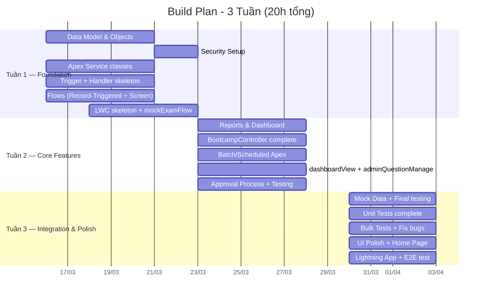
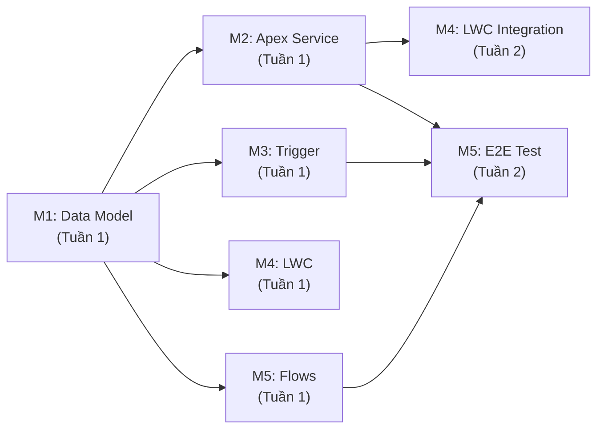

# 🚀 Master Build Plan — Salesforce Certification Bootcamp Manager

## Tổng quan dự án

| Thuộc tính | Giá trị |
| :--- | :--- |
| **Thời gian** | 3 tuần (Tuần 1-3) |
| **Tổng giờ** | 20 giờ (mỗi người ~4h = 5 người × 4h) |
| **Team** | 5 Members |
| **Org** | Salesforce Developer Org / Playground |
| **Tham chiếu** | `Salesforce_Bootcamp_Manager_BDD.md`, `Flow.md`, `Diagram.md` |

---

## 📅 Timeline tổng quan 3 tuần

---

## 👥 Phân công Members

| Member | Vai trò chính | Kỹ năng PD1 focus |
| :--- | :--- | :--- |
| **Member 1** | Data Model & Security & Reports | Objects, Relationships, OWD, Profiles, FLS, Reports, Dashboard |
| **Member 2** | Apex Backend (Controller + Service) | `@AuraEnabled`, SOQL, DML, Service Pattern, Error Handling |
| **Member 3** | Trigger & Async Apex | Trigger Handler Pattern, Bulkification, Batch, Schedulable |
| **Member 4** | LWC UI Components | `@wire`, Imperative Apex, CustomEvent, SLDS |
| **Member 5** | Flows & Integration & QA | Record-Triggered Flow, Screen Flow, Approval Process, Lightning App |

---

## 📋 TUẦN 1 — Foundation (7 giờ tổng, ~1.4h/người)

> **Mục tiêu:** Dựng xong Data Model, Security cơ bản, Apex Service skeleton, Trigger skeleton, Flows, LWC skeleton. Cuối tuần 1 có thể demo được flow thi thử cơ bản.

### Member 1 — Data Model & Security Setup (1.5h)

| # | Task | Mô tả chi tiết | Output | Thời gian |
| :--- | :--- | :--- | :--- | :--- |
| 1.1 | Tạo `Certification__c` | Tạo object + fields: `Name`, `Passing_Score__c` (Percent) | Object + 2 fields | 10 phút |
| 1.2 | Tạo `Enrollment__c` (Junction) | Object + Master-Detail × 2 (`Certification__c`, `User`), `Enrolled_Date__c`, `Status__c` picklist | Object + 4 fields | 15 phút |
| 1.3 | Tạo `Question__c` | Object + Lookup(`Certification__c`), `Question_Text__c`, `Option_A/B/C/D__c`, `Correct_Answer__c`, `Is_Active__c` | Object + 8 fields | 15 phút |
| 1.4 | Tạo `Attempt__c` | Object + Lookup(`User`), Lookup(`Certification__c`), `Score__c`, `Status__c`, `Attempt_Date__c` | Object + 5 fields | 10 phút |
| 1.5 | Tạo `Attempt_Answer__c` | Object + Master-Detail(`Attempt__c`), Lookup(`Question__c`), `Selected_Option__c`, `Is_Correct__c` (Formula) | Object + 4 fields | 15 phút |
| 1.6 | Roll-up Summary | Thêm `Total_Enrolled__c` = COUNT(`Enrollment__c`) trên `Certification__c` | 1 Roll-up field | 5 phút |
| 1.7 | Validation Rule | Tạo `Require_All_Options` trên `Question__c` | 1 Validation Rule | 5 phút |
| 1.8 | OWD Setup | `Certification__c`: Public Read Only, `Question__c`: Public Read Only, `Attempt__c`: Private, `Attempt_Answer__c`: Controlled by Parent, `Enrollment__c`: Controlled by Parent | OWD configured (5 Objects) | 10 phút |
| 1.9 | Profile: `Bootcamp_Student` | Clone Standard User → Set CRUD permissions theo BDD mục 11 | 1 Custom Profile | 15 phút |

### Member 2 — Apex Service Skeleton (1.5h)

| # | Task | Mô tả chi tiết | Output | Thời gian |
| :--- | :--- | :--- | :--- | :--- |
| 2.1 | `MockExamService.cls` | Tạo class `with sharing`, method `calculateAndSaveExam(certId, List<Map<String,String>> answers)` — Logic: query `Question__c`, so sánh đáp án, tính Score, insert `Attempt__c` + `Attempt_Answer__c` | 1 Apex class | 40 phút |
| 2.2 | `BootcampController.cls` — `getQuestions` | `@AuraEnabled` (NOT cacheable — cần random mỗi lần) — SOQL lấy `Question__c` active theo `certId`, shuffle random thứ tự trong Apex | 1 method | 15 phút |
| 2.3 | `BootcampController.cls` — `submitExam` | `@AuraEnabled` — Gọi `MockExamService`, return kết quả | 1 method | 15 phút |
| 2.4 | `BootcampController.cls` — `getCertifications` | `@AuraEnabled(cacheable=true)` — SOQL lấy danh sách `Certification__c` | 1 method | 10 phút |
| 2.5 | Error Handling pattern | Try-Catch ở tất cả `@AuraEnabled` methods → throw `AuraHandledException` | Pattern applied | 10 phút |

### Member 3 — Trigger + Handler Skeleton (1.5h)

| # | Task | Mô tả chi tiết | Output | Thời gian |
| :--- | :--- | :--- | :--- | :--- |
| 3.1 | `AttemptTrigger.trigger` | After Insert → delegate `AttemptTriggerHandler.handleAfterInsert(Trigger.new)` | 1 Trigger file | 10 phút |
| 3.2 | `AttemptTriggerHandler.cls` | `handleAfterInsert()`: Collect `CertId + StudentId` pairs → Query `Enrollment__c` → Update nếu cần, Logic: đã Pass thì cập nhật metadata trên Enrollment | 1 Apex class | 40 phút |
| 3.3 | Bulkification review | Đảm bảo: dùng `Set<Id>`, `Map<String, Enrollment__c>`, 1 SOQL + 1 DML, không loop SOQL | Code review | 15 phút |
| 3.4 | `LeaderboardRefreshBatch.cls` — skeleton | Implement `Database.Batchable<SObject>` + `Schedulable` interfaces, `start()` return QueryLocator | 1 Apex class | 25 phút |

### Member 4 — LWC Skeleton (1.5h)

| # | Task | Mô tả chi tiết | Output | Thời gian |
| :--- | :--- | :--- | :--- | :--- |
| 4.1 | `mockExamFlow` — Structure | Tạo component folder, HTML layout: dropdown `Certification` + container câu hỏi + buttons Next/Prev/Submit | 1 LWC component (HTML+JS+meta) | 30 phút |
| 4.2 | `mockExamFlow` — JS Logic | Import Apex methods, loadQuestions(), handleAnswer(), navigation logic, submitExam() gọi imperative Apex | JS controller | 30 phút |
| 4.3 | `mockExamFlow` — Result Modal | Sau submit: hiển thị modal SLDS với Score + Pass/Fail badge | Modal UI | 15 phút |
| 4.4 | `dashboardView` — Skeleton | Tạo component folder, HTML layout với `lightning-card` placeholders cho Stats, Leaderboard, Recent Attempts | 1 LWC component skeleton | 15 phút |

### Member 5 — Flows Setup (1h)

| # | Task | Mô tả chi tiết | Output | Thời gian |
| :--- | :--- | :--- | :--- | :--- |
| 5.1 | Record-Triggered Flow: `Auto_Set_Enrollment_Date` | Object: `Enrollment__c`, Trigger: After Insert, Condition: `Enrolled_Date__c = NULL`, Action: Update `Enrolled_Date__c = {!$Flow.CurrentDateTime}` | 1 Flow (Active) | 15 phút |
| 5.2 | Screen Flow: `Exam_Registration_Wizard` — Step 1 | Screen 1: Get Records `Certification__c` → Display choice set | Screen 1 | 15 phút |
| 5.3 | Screen Flow: `Exam_Registration_Wizard` — Step 2+3 | Screen 2: Confirmation display. Step 3: Create `Enrollment__c` (Status=Pending) → Success screen | Screen 2+3 + Create Record | 20 phút |
| 5.4 | Test Flows manually | Chạy thử cả 2 flows, verify data trong org | Verified | 10 phút |

---

## 📋 TUẦN 2 — Core Features (7 giờ tổng, ~1.4h/người)

> **Mục tiêu:** Hoàn thiện toàn bộ logic backend, LWC functional, Approval Process, Reports/Dashboard, Batch job. Cuối tuần 2: toàn bộ features chạy được end-to-end.

### Member 1 — Reports, Dashboard & FLS (1.5h)

| # | Task | Mô tả chi tiết | Output | Thời gian |
| :--- | :--- | :--- | :--- | :--- |
| 1.10 | FLS Setup | Hide `Correct_Answer__c` cho `Bootcamp_Student`. `Status__c` trên Enrollment: Read Only cho Student | FLS configured | 15 phút |
| 1.11 | Permission Set `Exam_Manager` | Create Permission Set, thêm Edit quyền trên `Question__c` | 1 Permission Set | 10 phút |
| 1.12 | Sharing Rule | Criteria-Based Sharing Rule: share `Attempt__c` tới Public Group `All_Admins` | 1 Sharing Rule | 10 phút |
| 1.13 | Report #1: Student Exam Results | Tabular Report trên `Attempt__c`: Student, Cert, Score, Status, Date | 1 Report | 10 phút |
| 1.14 | Report #2: Certification Enrollment Summary | Summary Report: Group by Certification, count Approved/Pending/Rejected | 1 Report | 10 phút |
| 1.15 | Report #3: Question Bank Overview | Summary Report: Group by Certification, count Active/Inactive | 1 Report | 10 phút |
| 1.16 | Dashboard | 3 components: Donut (Pass/Fail), Gauge (Avg Score), Metric (Total Enrollments) | 1 Dashboard | 15 phút |
| 1.17 | Insert Mock Data | Tạo 2-3 Certifications, 10+ Questions mỗi cert, 2+ Student Users | Sample data | 10 phút |

### Member 2 — Controller hoàn thiện + Unit Tests (1.5h)

| # | Task | Mô tả chi tiết | Output | Thời gian |
| :--- | :--- | :--- | :--- | :--- |
| 2.6 | `BootcampController.getDashboardStats` | `@AuraEnabled(cacheable=true)` — Query `Attempt__c` cho current user, tính Avg Score, Readiness, Next Action, Recent Attempts | 1 method | 20 phút |
| 2.7 | `BootcampController.getLeaderboard` | `@AuraEnabled(cacheable=true)` — SOQL: `AVG(Score__c)` GROUP BY `Student__c` ORDER DESC LIMIT 5 | 1 method | 15 phút |
| 2.8 | `BootcampController.getAllQuestions` | `@AuraEnabled(cacheable=true)` — Dành cho Admin, lấy tất cả `Question__c` | 1 method | 10 phút |
| 2.9 | `BootcampTestFactory.cls` | Test Data Factory: `createCertification()`, `createQuestions()`, `createUser()`, `createEnrollment()` | 1 Utility class | 20 phút |
| 2.10 | `MockExamServiceTest.cls` | Positive: Submit 10 câu → Score đúng. Negative: Submit rỗng → Exception | 1 Test class | 25 phút |

### Member 3 — Batch/Scheduled + Unit Tests (1.5h)

| # | Task | Mô tả chi tiết | Output | Thời gian |
| :--- | :--- | :--- | :--- | :--- |
| 3.5 | `LeaderboardRefreshBatch` — `execute()` complete | Aggregate AVG `Score__c` per Student, log results. (Cache mechanism: tuỳ chọn Custom Setting hoặc log only cho MVP) | Complete Batch | 20 phút |
| 3.6 | `LeaderboardRefreshBatch` — `execute(SchedulableContext)` | Implement Schedulable method, `Database.executeBatch(new LeaderboardRefreshBatch(), 200)` | Schedulable ready | 10 phút |
| 3.7 | `AttemptTriggerHandlerTest.cls` | Positive: Insert 1 Attempt → Enrollment updated. Bulk: Insert 200 Attempts → No governor limit error | 1 Test class | 30 phút |
| 3.8 | `LeaderboardRefreshBatchTest.cls` | `Test.startTest()` → `Database.executeBatch()` → `Test.stopTest()` → verify results | 1 Test class | 20 phút |
| 3.9 | Schedule job setup | `System.schedule('Leaderboard Daily', '0 0 2 * * ?', new LeaderboardRefreshBatch())` | Scheduled job | 10 phút |

### Member 4 — LWC Completion (1.5h)

| # | Task | Mô tả chi tiết | Output | Thời gian |
| :--- | :--- | :--- | :--- | :--- |
| 4.5 | `dashboardView` — Stats Cards | Wire `getDashboardStats`, render: Total Certs Enrolled, Avg Score, Readiness Status badge, Progress Bar | Functional stats | 20 phút |
| 4.6 | `dashboardView` — Leaderboard | Wire `getLeaderboard`, render Top 5 bảng xếp hạng (Name + Avg Score) | Leaderboard table | 15 phút |
| 4.7 | `dashboardView` — Recent Attempts | Datatable hiển thị 5 attempts gần nhất: Cert, Score, Status, Date | Recent attempts list | 15 phút |
| 4.8 | `adminQuestionManage` — Datatable | Wire `getAllQuestions`, `lightning-datatable` columns: Cert, Question Text, Is_Active, Actions | 1 LWC component | 20 phút |
| 4.9 | `newQuestionModal` | `lightning-record-edit-form` với fields: Certification, Question_Text, Options A-D, Correct_Answer | 1 LWC component | 20 phút |

### Member 5 — Approval Process + Integration Test (1h)

| # | Task | Mô tả chi tiết | Output | Thời gian |
| :--- | :--- | :--- | :--- | :--- |
| 5.5 | Approval Process: `Enrollment_Approval` | Object: `Enrollment__c`, Entry: `Status__c = Pending`, Approver: Admin, Approve→Approved, Reject→Rejected | 1 Approval Process | 20 phút |
| 5.6 | Test Enrollment → Approval flow | Tạo Enrollment qua Screen Flow → Submit → Admin Approve → Verify Status | Verified flow | 15 phút |
| 5.7 | Test Mock Exam flow end-to-end | Student login → Chọn Cert → Làm bài → Submit → Verify Attempt + Attempt_Answer + Score | Verified flow | 15 phút |
| 5.8 | Bug list compilation | Ghi nhận tất cả bugs/issues tìm thấy → Share với team | Bug report | 10 phút |

---

## 📋 TUẦN 3 — Integration, Polish & Final Testing (6 giờ tổng, ~1.2h/người)

> **Mục tiêu:** Fix bugs, hoàn thiện Test Coverage ≥ 75%, Lightning App config, Home Page setup, demo-ready.

### Member 1 — Home Page & Final Data (1h)

| # | Task | Mô tả chi tiết | Output | Thời gian |
| :--- | :--- | :--- | :--- | :--- |
| 1.18 | Home Page Layout | Tạo Lightning Home Page: nhúng `dashboardView` LWC + nhúng Dashboard native | Home Page | 15 phút |
| 1.19 | Profile-based Home Page (Optional) | Student Home vs Admin Home (nếu kịp) | Conditional Home | 15 phút |
| 1.20 | Final Mock Data | Thêm data đủ để demo đẹp: 3 certs, 15+ questions/cert, 5 students, 10+ attempts | Rich demo data | 20 phút |
| 1.21 | Final Security Review | Verify: Student không thấy Correct_Answer, OWD Private work, Sharing Rule work | Verified | 10 phút |

### Member 2 — Test Coverage & Bug Fix (1.2h)

| # | Task | Mô tả chi tiết | Output | Thời gian |
| :--- | :--- | :--- | :--- | :--- |
| 2.11 | `BootcampControllerTest.cls` | Test `getDashboardStats`, `getLeaderboard`, `getCertifications`, `getQuestions`, `getAllQuestions`, `submitExam` | 1 Test class | 30 phút |
| 2.12 | Security Test | `System.runAs(studentUser)` → verify không đọc `Correct_Answer__c` | Security assertions | 15 phút |
| 2.13 | Bug fixes (from Week 2 report) | Fix bugs assigned bởi Member 5 | Bug fixes | 15 phút |
| 2.14 | Coverage check | Run All Tests → Verify ≥ 75%. Nếu thiếu → bổ sung test cases | Coverage ≥ 75% | 10 phút |

### Member 3 — Bulk Test & Bug Fix (1.2h)

| # | Task | Mô tả chi tiết | Output | Thời gian |
| :--- | :--- | :--- | :--- | :--- |
| 3.10 | Bulk Test 200 records | Insert 200 `Attempt__c` đồng loạt → Trigger xử lý đúng | Bulk verified | 20 phút |
| 3.11 | Negative Tests | Submit exam thiếu answer → Exception. Trigger xử lý record không có Enrollment | Negative tests | 15 phút |
| 3.12 | Bug fixes | Fix bugs liên quan Trigger/Batch | Bug fixes | 15 phút |
| 3.13 | Final Batch test | Run Batch manually → verify kết quả aggregate đúng | Batch verified | 15 phút |

### Member 4 — UI Polish & Activate/Deactivate (1.2h)

| # | Task | Mô tả chi tiết | Output | Thời gian |
| :--- | :--- | :--- | :--- | :--- |
| 4.10 | Activate/Deactivate button | `adminQuestionManage`: Row action toggle `Is_Active__c`, imperative Apex call, refresh datatable | Feature complete | 15 phút |
| 4.11 | SLDS Polish | Đảm bảo tất cả components dùng SLDS tokens, spacing, responsive cards | Polished UI | 20 phút |
| 4.12 | Next Action Button | `dashboardView`: Next Action message + functional button (Navigate to Mock Exam hoặc show congrats) | Feature complete | 15 phút |
| 4.13 | Bug fixes UI | Fix bugs liên quan LWC display, data binding | Bug fixes | 15 phút |

### Member 5 — Lightning App & Final E2E (1.2h)

| # | Task | Mô tả chi tiết | Output | Thời gian |
| :--- | :--- | :--- | :--- | :--- |
| 5.9 | Lightning App Config | Tạo App: name, logo, brand color `#1B5E20`, nav tabs: Home, Mock Exam, Admin Questions, Reports | 1 Lightning App | 15 phút |
| 5.10 | Tab Setup | Tạo Custom Tabs cho các LWC pages, configure Lightning Pages | Tabs + Pages | 15 phút |
| 5.11 | Full E2E Test — Student Flow | Login Student → Home → Enroll → Approval → Take Exam → View Dashboard → Leaderboard | E2E verified | 20 phút |
| 5.12 | Full E2E Test — Admin Flow | Login Admin → Manage Questions → Approve Enrollment → View Reports + Dashboard | E2E verified | 15 phút |
| 5.13 | Final checklist | Chạy BDD Checklist 26 mục → đánh dấu ✅ từng mục | Checklist complete | 10 phút |

---

## 🔗 Dependencies giữa các Members

> **⚠️ CRITICAL:** Member 1 phải hoàn thành Data Model (Task 1.1–1.7) **TRƯỚC** khi các member khác bắt đầu code. Khuyến khích M1 setup Objects ngay giờ đầu tiên của Tuần 1.

---

## 📊 Bảng phân bổ giờ tổng hợp

| Member | Tuần 1 | Tuần 2 | Tuần 3 | Tổng |
| :--- | :--- | :--- | :--- | :--- |
| **Member 1** | 1.5h | 1.5h | 1.0h | **4.0h** |
| **Member 2** | 1.5h | 1.5h | 1.2h | **4.2h** |
| **Member 3** | 1.5h | 1.5h | 1.2h | **4.2h** |
| **Member 4** | 1.5h | 1.5h | 1.2h | **4.2h** |
| **Member 5** | 1.0h | 1.0h | 1.2h | **3.2h** |
| **Tổng** | **7.0h** | **7.0h** | **5.8h** | **~20h** |

---

## 🚨 Risk Management

| Rủi ro | Khả năng | Giải pháp |
| :--- | :--- | :--- |
| M1 delay → block cả team | Cao | M1 ưu tiên Objects trước, Security sau |
| LWC modal phức tạp | Trung bình | Dùng `lightning-record-edit-form` thay custom modal |
| Test coverage < 75% | Thấp | M5 QA chuyên trách, `BootcampTestFactory` dùng chung |
| Flow config lâu | Thấp | Ưu tiên Record-Triggered Flow trước (đơn giản) |
| Merge conflict trên cùng class | Trung bình | Mỗi người sở hữu riêng file, chỉ M2 sở hữu `BootcampController` |

---

## 📁 File Ownership Matrix

| File/Component | Owner | Reviewers |
| :--- | :--- | :--- |
| 5 Custom Objects + Fields | Member 1 | All |
| Profiles, OWD, FLS, Sharing Rule | Member 1 | Member 5 |
| Reports × 3, Dashboard | Member 1 | Member 5 |
| `BootcampController.cls` | Member 2 | Member 3, 4 |
| `MockExamService.cls` | Member 2 | Member 3 |
| `BootcampTestFactory.cls` | Member 2 | All |
| `MockExamServiceTest.cls` | Member 2 | Member 5 |
| `BootcampControllerTest.cls` | Member 2 | Member 5 |
| `AttemptTrigger.trigger` | Member 3 | Member 2 |
| `AttemptTriggerHandler.cls` | Member 3 | Member 2 |
| `LeaderboardRefreshBatch.cls` | Member 3 | Member 2 |
| `AttemptTriggerHandlerTest.cls` | Member 3 | Member 5 |
| `LeaderboardRefreshBatchTest.cls` | Member 3 | Member 5 |
| `mockExamFlow` LWC | Member 4 | Member 2 |
| `dashboardView` LWC | Member 4 | Member 2 |
| `adminQuestionManage` LWC | Member 4 | Member 2 |
| `newQuestionModal` LWC | Member 4 | Member 2 |
| Record-Triggered Flow | Member 5 | Member 1 |
| Screen Flow Wizard | Member 5 | Member 1 |
| Approval Process | Member 5 | Member 1 |
| Lightning App + Home Page | Member 5 | Member 1 |

---

## ✅ Definition of Done

Dự án hoàn thành khi **TẤT CẢ** items trong BDD Checklist 26 mục (Mục 20) được đánh dấu ✅:

1. ✅ Custom Lightning App (logo, brand color, tabs)
2. ✅ 5 Custom Objects với đầy đủ Fields
3. ✅ Lookup Relationship (Question→Cert, Attempt→User, Attempt→Cert)
4. ✅ Master-Detail (Attempt_Answer→Attempt, Enrollment→Cert, Enrollment→User)
5. ✅ Many-to-Many Junction (`Enrollment__c`)
6. ✅ 1+ Validation Rule (`Require_All_Options`)
7. ✅ 1+ Roll-up Summary (`Total_Enrolled__c`)
8. ✅ 2 Profiles (`Bootcamp_Student` + `System Administrator`)
9. ✅ FLS khác biệt (`Correct_Answer__c` hidden cho Student)
10. ✅ OWD (Private cho Attempt, Public RO cho Cert/Question, Controlled by Parent cho Enrollment/Attempt_Answer)
11. ✅ 1 Permission Set (`Exam_Manager`)
12. ✅ 1 Record-Triggered Flow (`Auto_Set_Enrollment_Date`)
13. ✅ 1 Screen Flow Wizard (`Exam_Registration_Wizard`)
14. ✅ 1 Approval Process (`Enrollment_Approval`)
15. ✅ 1 Apex Trigger + Handler (`AttemptTrigger` + `AttemptTriggerHandler`)
16. ✅ 1 Batch + Schedulable Apex (`LeaderboardRefreshBatch`)
17. ✅ 4 LWC Components (`dashboardView`, `mockExamFlow`, `adminQuestionManage`, `newQuestionModal`)
18. ✅ SLDS compliance (card, datatable, SLDS classes)
19. ✅ 3 Reports (Student Exam Results, Certification Enrollment Summary, Question Bank Overview)
20. ✅ 1 Dashboard (Donut Chart + Gauge + Metric)
21. ✅ Home Page (Dashboard native + LWC `dashboardView` nhúng)
22. ✅ Test: Positive / Negative / Bulk cases
23. ✅ Code Coverage ≥ 75% (mục tiêu 85%)
24. ✅ ERD Diagram (Mermaid)
25. ✅ Business Process Flow (2 Flowcharts)
26. ✅ Bảng đặc tả Trigger/Flow (5 mục)
