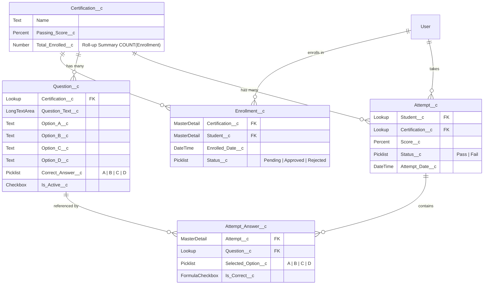

```mermaid
erDiagram
    Certification__c {
        Text Name
        Percent Passing_Score__c
        Number Total_Enrolled__c "Roll-up Summary COUNT(Enrollment)"
    }

    Enrollment__c {
        MasterDetail Certification__c FK
        MasterDetail Student__c FK
        DateTime Enrolled_Date__c
        Picklist Status__c "Pending | Approved | Rejected"
    }

    Question__c {
        Lookup Certification__c FK
        LongTextArea Question_Text__c
        Text Option_A__c
        Text Option_B__c
        Text Option_C__c
        Text Option_D__c
        Picklist Correct_Answer__c "A | B | C | D"
        Checkbox Is_Active__c
    }

    Attempt__c {
        Lookup Student__c FK
        Lookup Certification__c FK
        Percent Score__c
        Picklist Status__c "Pass | Fail"
        DateTime Attempt_Date__c
    }

    Attempt_Answer__c {
        MasterDetail Attempt__c FK
        Lookup Question__c FK
        Picklist Selected_Option__c "A | B | C | D"
        FormulaCheckbox Is_Correct__c
    }

    Certification__c ||--o{ Enrollment__c : "has many"
    User ||--o{ Enrollment__c : "enrolls in"
    Certification__c ||--o{ Question__c : "has many"
    Certification__c ||--o{ Attempt__c : "has many"
    User ||--o{ Attempt__c : "takes"
    Attempt__c ||--o{ Attempt_Answer__c : "contains"
    Question__c ||--o{ Attempt_Answer__c : "referenced by"
```