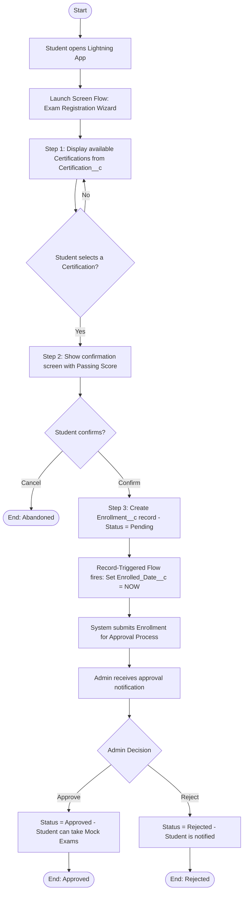
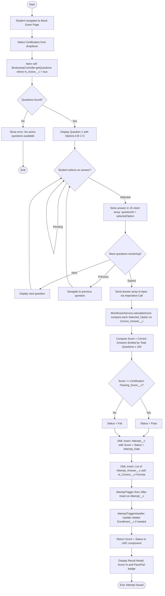
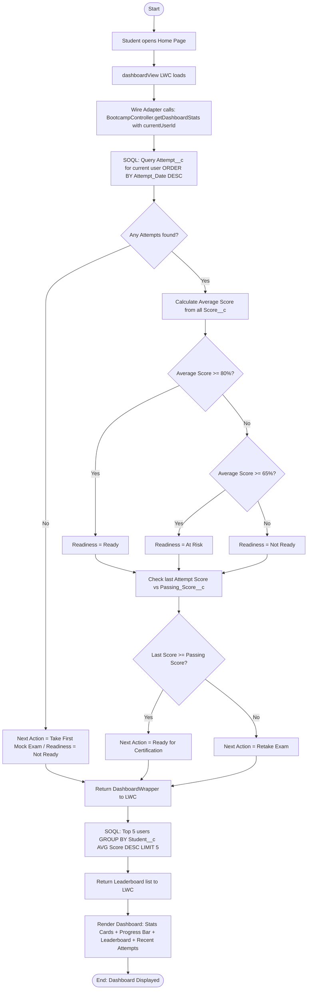
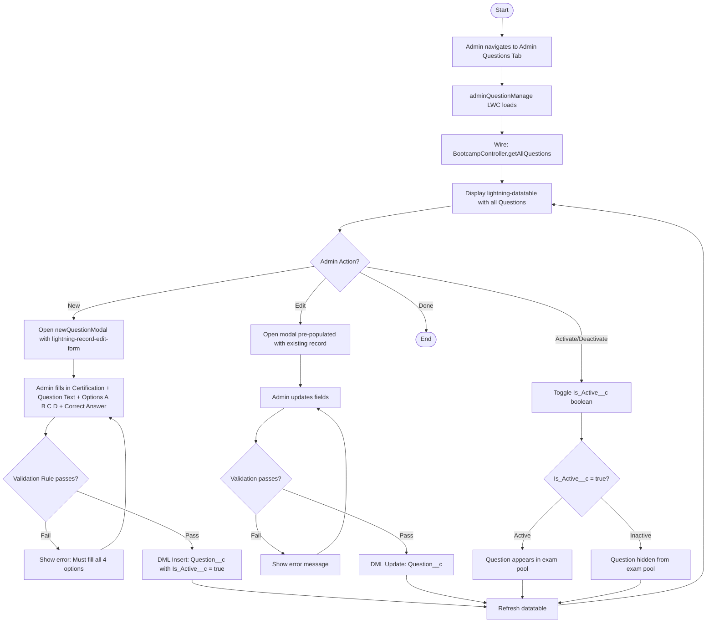
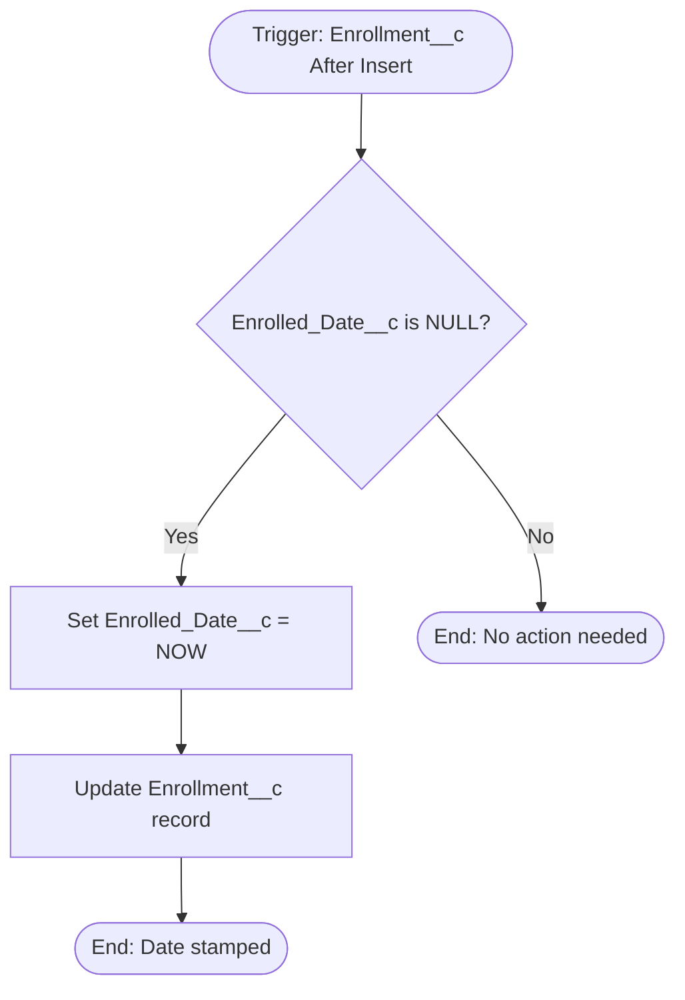
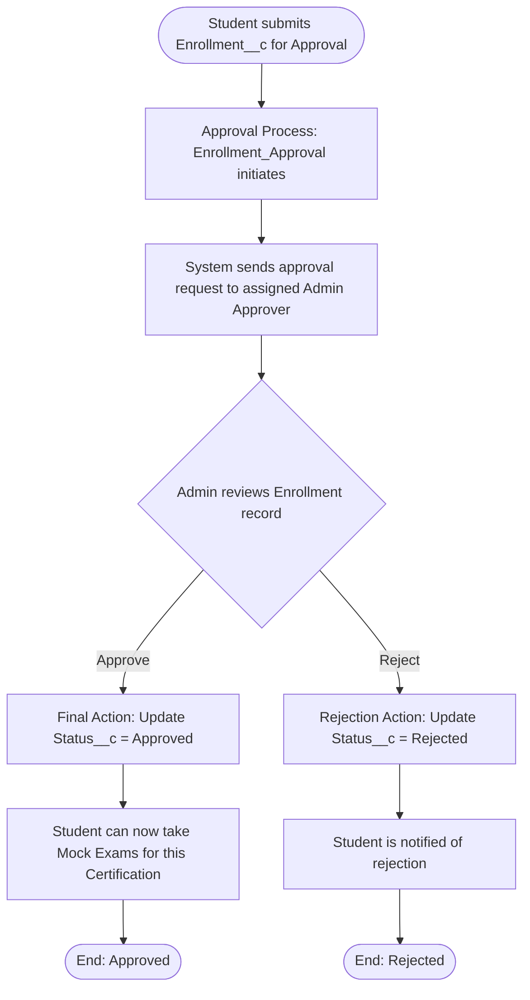
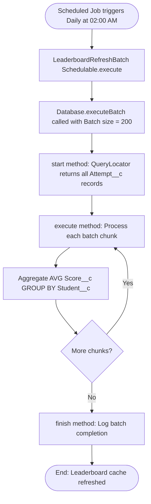
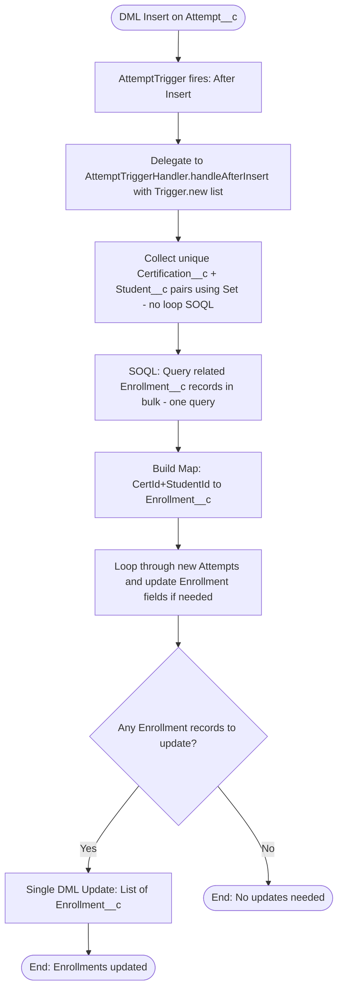

# Business Process Flows — Salesforce Certification Bootcamp Manager

---

## Flow 1: Student Enrollment Process

---

## Flow 2: Mock Exam Process

---

## Flow 3: Dashboard Data Loading

---

## Flow 4: Admin Question Management

---

## Flow 5: Record-Triggered Flow — Auto Set Enrollment Date

---

## Flow 6: Approval Process — Enrollment Approval

---

## Flow 7: Async Apex — LeaderboardRefreshBatch

---

## Flow 8: Apex Trigger — AttemptTriggerHandler

