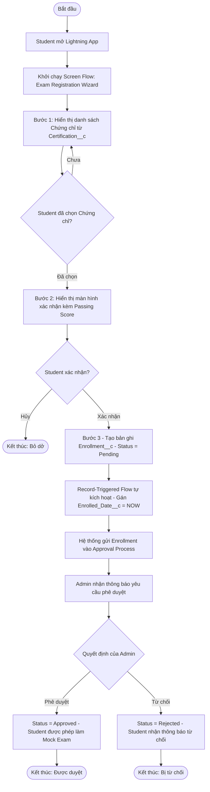
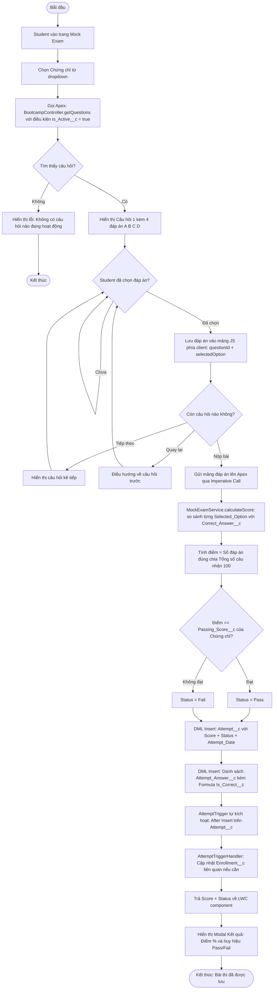
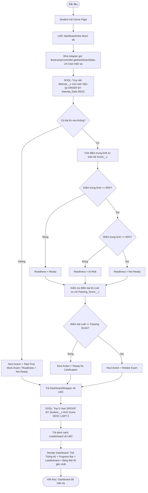
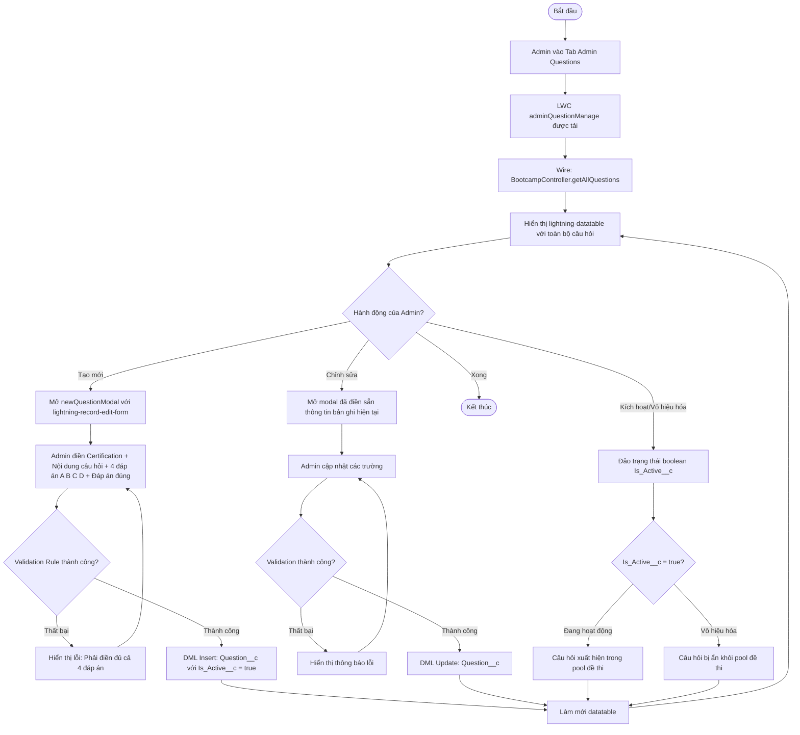
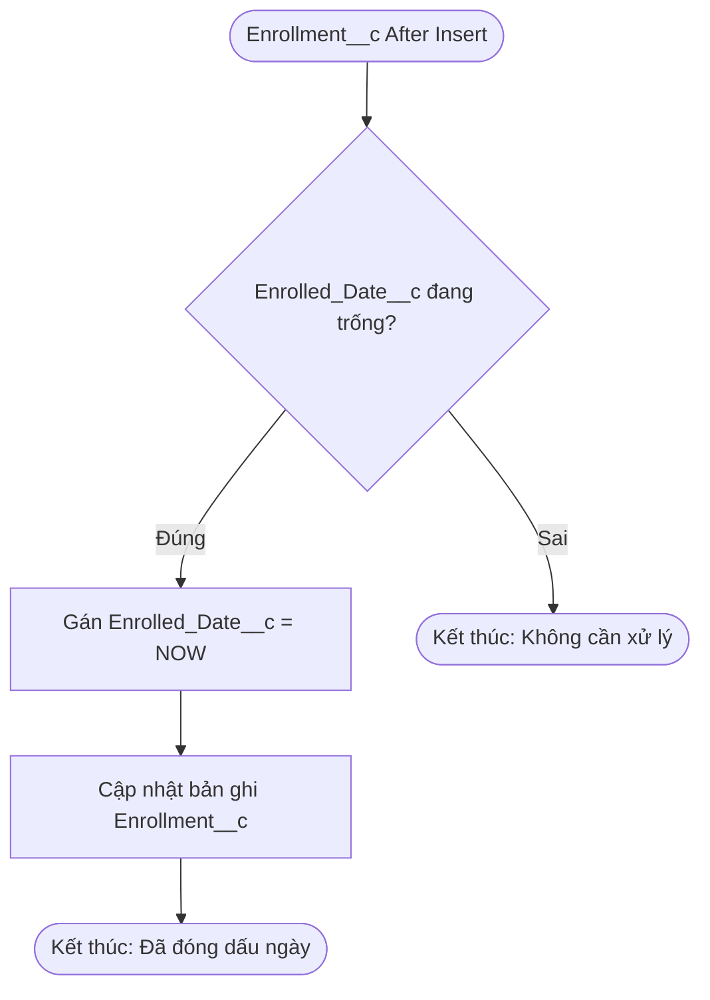
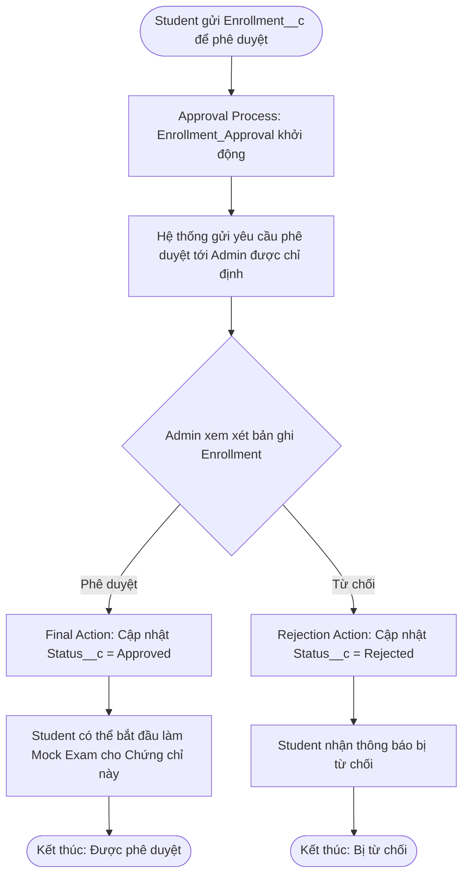
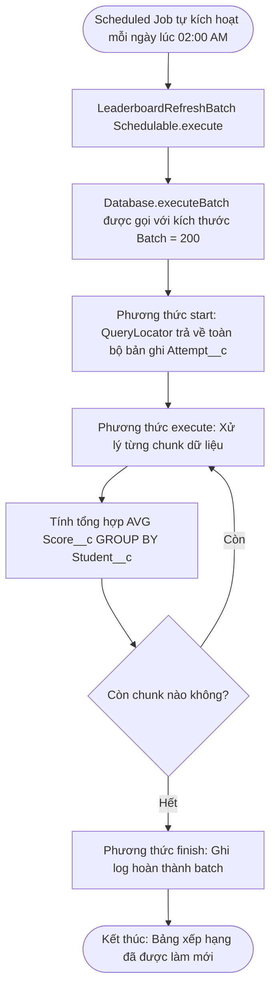
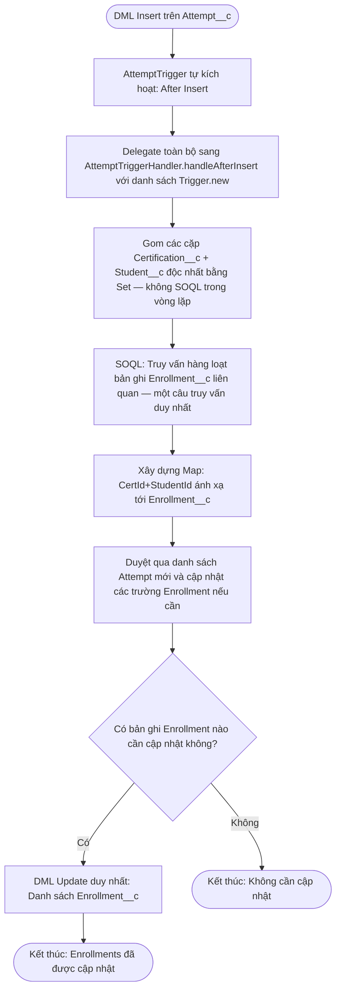

# Business Process Flows — Salesforce Certification Bootcamp Manager

---

## Flow 1: Quy trình Đăng ký Chứng chỉ (Student Enrollment)

---

## Flow 2: Quy trình Thi thử (Mock Exam)

---

## Flow 3: Tải dữ liệu Dashboard (Dashboard Data Loading)

---

## Flow 4: Admin Quản lý Câu hỏi (Admin Question Management)

---

## Flow 5: Record-Triggered Flow — Tự động gán Ngày đăng ký

---

## Flow 6: Approval Process — Phê duyệt Đăng ký

---

## Flow 7: Async Apex — LeaderboardRefreshBatch

---

## Flow 8: Apex Trigger — AttemptTriggerHandler

