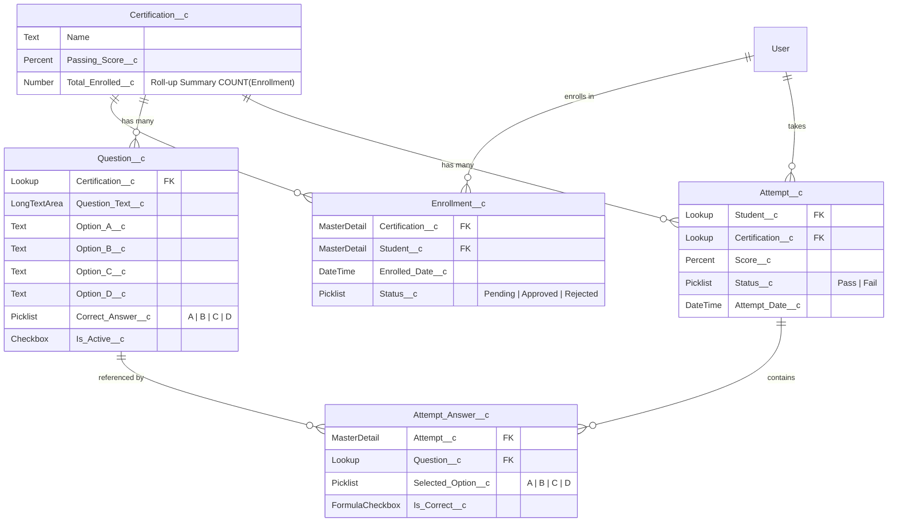
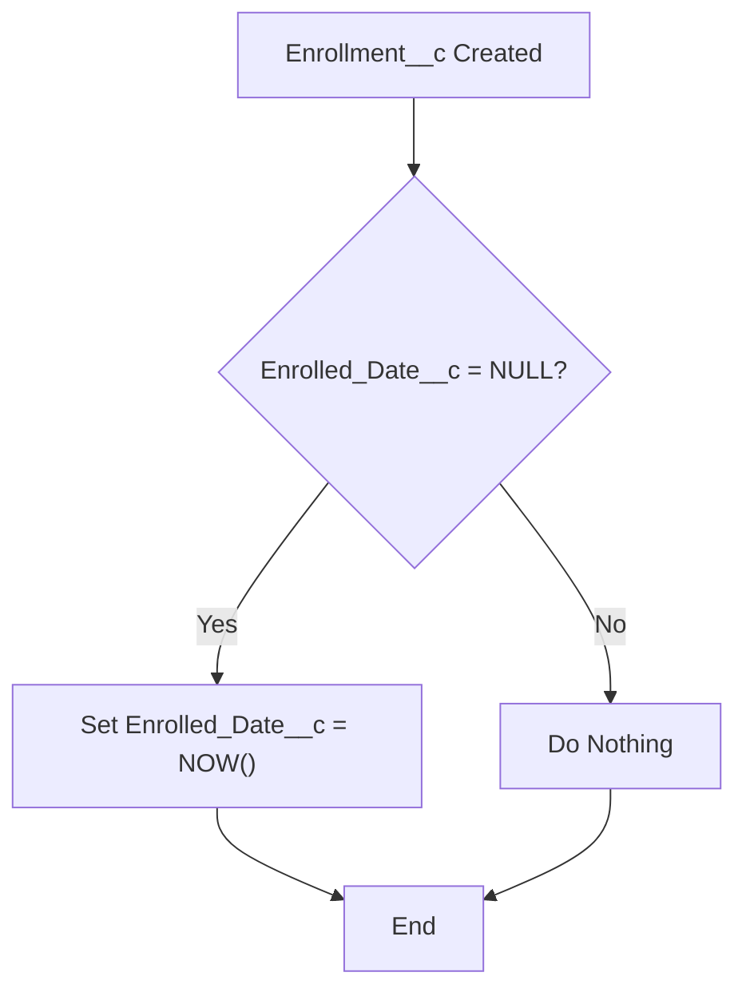
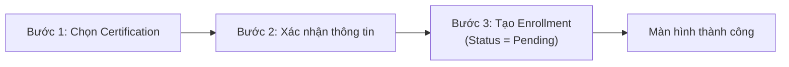
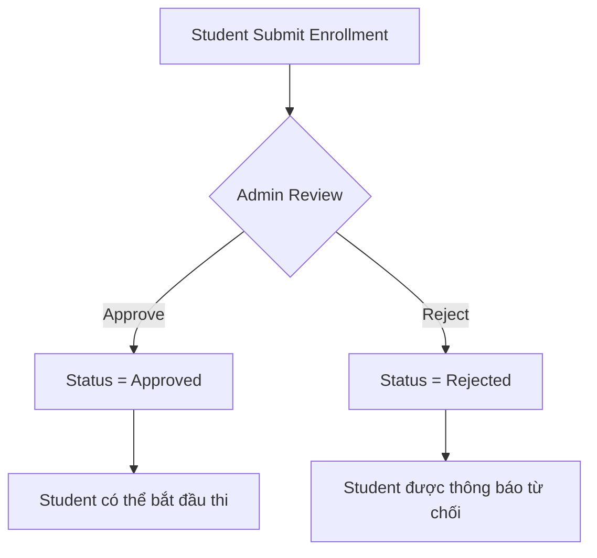
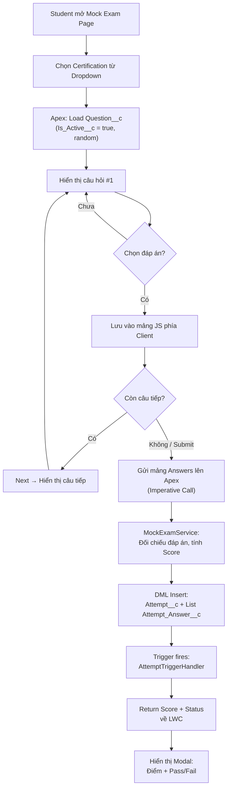
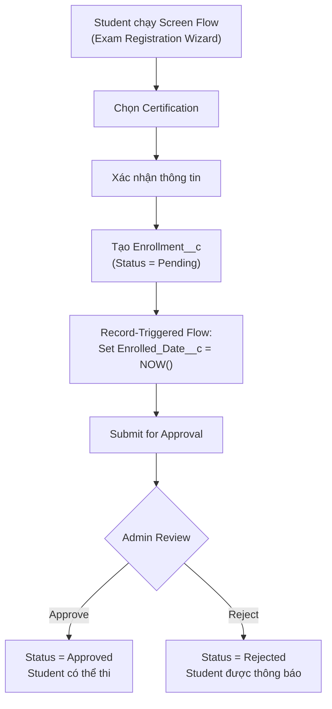

# Tài liệu Thiết kế Cơ bản (Basic Design Document)
## Dự án: Salesforce Certification Bootcamp Manager

---

### 1. Giới thiệu (Introduction)
*   **Tổng quan dự án:** "Salesforce Certification Bootcamp Manager" là ứng dụng quản lý ôn thi chứng chỉ Salesforce, cho phép học viên làm bài thi thử (mock exam), xem điểm tự động và theo dõi mức độ sẵn sàng.
*   **Mục tiêu:** Củng cố kiến thức Platform Developer I (PD1): Data Model, SOQL, DML, Apex, Triggers, Async Apex, Flows, LWC, Security, Test Classes.
*   **Bối cảnh:** Dự án thực hành MVP cho nhóm 5 developer, 14 giờ phát triển (2 phiên × 7h).
*   **Triết lý MVP:** Đơn giản, code sạch, chức năng cốt lõi. Không over-engineering.

---

### 2. Định nghĩa phạm vi (Scope Definition)

**Trong phạm vi (In Scope):**
*   Thi thử trắc nghiệm (1 đáp án đúng), tự động tính điểm, Next Action, Leaderboard, quản lý câu hỏi Admin.
*   Lightning App cấu hình riêng, Record-Triggered Flow, Screen Flow, Approval Process, Apex Trigger + Handler, Batch/Scheduled Apex.
*   3 Reports + 1 Dashboard native Salesforce + Home Page tùy chỉnh.

**Ngoài phạm vi (Out of Scope):**
*   Trang Certification Detail, tích hợp bên ngoài, AI, biểu đồ phân tích phức tạp, trend analysis, Mobile optimization, Experience Cloud.

**Ràng buộc:** 14 giờ, 5 developer. Thiết kế phải khả thi với tiêu chí: Đơn giản → Chạy được → Đúng chuẩn PD1.

---

### 3. Vai trò người dùng (User Roles)

| Vai trò | Trách nhiệm | Profile | CRUD Access |
| :--- | :--- | :--- | :--- |
| **Student** | Làm mock exam, xem Dashboard & kết quả | `Bootcamp_Student` | Read: `Certification__c`, `Question__c`. Create/Read: `Attempt__c`, `Attempt_Answer__c`, `Enrollment__c`. |
| **Admin** | Quản lý câu hỏi, phê duyệt enrollment, xem toàn bộ kết quả | `System Administrator` | Full CRUD tất cả Objects. |

---

### 4. Cấu trúc Lightning App

| Thuộc tính | Giá trị |
| :--- | :--- |
| App Name | Certification Bootcamp Manager |
| Logo | Custom logo (hình chứng chỉ / mũ tốt nghiệp) |
| Brand Color | `#1B5E20` (Xanh lá đậm - Education theme) |
| Navigation Tabs | Home, Mock Exam, Admin Questions, Reports |

---

### 5. Yêu cầu chức năng (Functional Requirements)

Hệ thống bao gồm **3 màn hình LWC chính:**

#### A. Dashboard (Home Page)
*   **Dữ liệu:** Tổng certifications enrolled, Điểm trung bình, Readiness Status, Progress Bar, Leaderboard Top 5, Bảng Attempts gần nhất, Next Action message.
*   **Backend:** SOQL Aggregate tính on-the-fly khi load LWC. Không lưu trữ dữ liệu tổng hợp.

#### B. Mock Exam (Thi thử)
*   **Luồng:** Dropdown chọn Certification → Hiển thị câu hỏi → Chọn đáp án → Next/Prev → Submit → Modal kết quả (Điểm + Pass/Fail).
*   **Backend:** Apex trả list `Question__c` (active, random). Khi nộp: tính điểm → Insert `Attempt__c` + list `Attempt_Answer__c`.

#### C. Admin Question Management
*   **Giao diện:** `lightning-datatable` hiển thị câu hỏi. Modal (New Question Modal) để Create/Edit. Nút Activate/Deactivate.
*   **Validation:** Bắt buộc 4 đáp án + 1 Correct Answer.

---

### 6. Thiết kế mô hình dữ liệu (Data Model Design)

**5 Custom Objects**, đủ 3 loại Relationship: Lookup, Master-Detail, Many-to-Many (Junction Object).

#### ERD (Entity Relationship Diagram)



#### Chi tiết từng Object

**1. Certification__c**

> **Overview:** Đại diện cho một **Chứng chỉ Salesforce** (ví dụ: Admin, Platform Developer I, App Builder). Nó đóng vai trò là danh mục gốc (root catalog) lưu trữ nền tảng khóa học.
> **Ý nghĩa Relationship:** Là trung tâm chia sẻ dữ liệu. Một chứng chỉ quản lý một ngân hàng câu hỏi riêng (chứa nhiều `Question__c`) và có nhiều học viên đăng ký theo học (thông qua `Enrollment__c`).

| Field | Type | Required | Ghi chú |
| :--- | :--- | :--- | :--- |
| `Name` | Text(80) | ✅ | Tên chứng chỉ |
| `Passing_Score__c` | Percent | ✅ | Ngưỡng đậu (vd: 65%) |
| `Total_Enrolled__c` | Roll-up Summary | Auto | **COUNT** trên `Enrollment__c` |

**2. Enrollment__c** ⭐ **Junction Object (Many-to-Many)**

> **Overview:** Quản lý **việc đăng ký học** của sinh viên đối với một chứng chỉ cụ thể.
> **Ý nghĩa Relationship:** Đây là đối tượng trung gian (**Junction Object**) bắt buộc để giải quyết bài toán biểu diễn dữ liệu "Nhiều - Nhiều" (Many-to-Many). Một học viên có thể đăng ký học nhiều chứng chỉ, và một chứng chỉ có thể được hàng trăm học viên ghi danh. Nếu không thiết kế object này, hệ thống sẽ không thể lưu bổ sung các trạng thái thuộc về cá nhân như Trạng thái phê duyệt (Pending/Approved) hay Ngày ghi danh.

| Field | Type | Required | Ghi chú |
| :--- | :--- | :--- | :--- |
| `Certification__c` | Master-Detail | ✅ | Liên kết tới Certification |
| `Student__c` | Master-Detail (User) | ✅ | Liên kết tới User |
| `Enrolled_Date__c` | DateTime | ✅ | Ngày đăng ký |
| `Status__c` | Picklist | ✅ | Pending / Approved / Rejected |

**3. Question__c**

> **Overview:** Đại diện cho một **câu hỏi trắc nghiệm** đơn lẻ nằm trong bộ ngân hàng đề thi. Nó đóng gói phần văn bản câu hỏi, 4 đáp án lựa chọn và chỉ định sẵn đâu là đáp án đúng (Correct Answer) để đối chiếu chấm điểm tự động.
> **Ý nghĩa Relationship:** Kết nối cấp con (Lookup) với `Certification__c` để xác định câu hỏi này thuộc về giáo trình kỳ thi nào. Sử dụng là kho dữ liệu (pool) để Apex truy xuất hỗn hợp mix random khi user thực hiện thi thử.

| Field | Type | Required | Ghi chú |
| :--- | :--- | :--- | :--- |
| `Certification__c` | Lookup | ✅ | Liên kết Certification (Lookup để nới lỏng ownership) |
| `Question_Text__c` | Long Text Area | ✅ | Nội dung câu hỏi |
| `Option_A__c` | Text(255) | ✅ | Đáp án A |
| `Option_B__c` | Text(255) | ✅ | Đáp án B |
| `Option_C__c` | Text(255) | ✅ | Đáp án C |
| `Option_D__c` | Text(255) | ✅ | Đáp án D |
| `Correct_Answer__c` | Picklist | ✅ | A / B / C / D |
| `Is_Active__c` | Checkbox | ✅ | Default = true |

**Validation Rule trên Question__c:**
*   **Tên:** `Require_All_Options`
*   **Điều kiện:** `OR(ISBLANK(Option_A__c), ISBLANK(Option_B__c), ISBLANK(Option_C__c), ISBLANK(Option_D__c))`
*   **Error:** "Phải điền đủ cả 4 đáp án (A, B, C, D)."

**4. Attempt__c**

> **Overview:** Lưu vết lịch sử của **một lần thi thử (Mock Exam Session)**. Mỗi khi sinh viên bấm nộp bài thực hiện xong vòng thi, một Record Attempt sẽ được hệ thống Insert vào CSDL để ghi nhận: bài làm của ai, thi môn gì, ngày làm bài, Tỉ lệ Điểm tổng (Score) và đánh giá qua môn hay rớt môn (Pass/Fail).
> **Ý nghĩa Relationship:** Là trung tâm tính toán Readiness và Bảng xếp hạng cho logic Apex. Liên kết theo dạng `Lookup` đến User thay vì Master-Detail để giúp các bài thi có thể duy trì quyền hiển thị an toàn độc lập (thiết lập OWD mức Private cho Attempt__c, có nghĩa bài ai nấy xem).

| Field | Type | Required | Ghi chú |
| :--- | :--- | :--- | :--- |
| `Student__c` | Lookup(User) | ✅ | Học viên |
| `Certification__c` | Lookup | ✅ | Chứng chỉ thi |
| `Score__c` | Percent | ✅ | Điểm thi |
| `Status__c` | Picklist | ✅ | Pass / Fail |
| `Attempt_Date__c` | DateTime | ✅ | Thời điểm thi |

**5. Attempt_Answer__c**

> **Overview:** Bản ghi chi tiết, lưu dấu vết thông tin của **từng câu trả lời đơn lẻ** mà phần thao tác tay UI học viên đã tích chọn trong kỳ thi (`Attempt__c`).
> **Ý nghĩa Relationship:** Áp dụng **bắt buộc quan hệ Master-Detail** tới cha là `Attempt__c`. Thiết kế này vì mục đích dọn dẹp Database (Data Integrity): Bản chất một lần nộp bài tạo ra hàng chục bản ghi Answer con rác. Khi người có quyền lực (Admin) chủ động xóa đối tượng Lần thi (`Attempt__c`) cha, toàn bộ mấy chục câu Answer con sẽ bị Database tự động càn quét dọn sạch sẽ đi theo (Cascade Data Delete). Cực kì an toàn, object rác không bao giờ được phép mồ côi trong hệ thống.

| Field | Type | Required | Ghi chú |
| :--- | :--- | :--- | :--- |
| `Attempt__c` | **Master-Detail** | ✅ | Cascade delete khi xoá Attempt |
| `Question__c` | Lookup | ✅ | Câu hỏi tương ứng |
| `Selected_Option__c` | Picklist | ✅ | A / B / C / D |
| `Is_Correct__c` | Formula(Checkbox) | Auto | `Selected_Option__c = Question__r.Correct_Answer__c` |

#### Tổng hợp Relationship Coverage

| Loại Relationship | Ví dụ trong hệ thống | ✅ |
| :--- | :--- | :--- |
| **Lookup** | `Question__c` → `Certification__c`, `Attempt__c` → `User`, `Attempt__c` → `Certification__c` | ✅ |
| **Master-Detail** | `Attempt_Answer__c` → `Attempt__c`, `Enrollment__c` → `Certification__c`, `Enrollment__c` → `User` | ✅ |
| **Many-to-Many (Junction)** | `Enrollment__c` nối `User` ↔ `Certification__c` | ✅ |
| **Roll-up Summary** | `Certification__c.Total_Enrolled__c` = COUNT(`Enrollment__c`) | ✅ |

---

### 7. Thiết kế Logic Nghiệp vụ (Business Logic Design)

#### A. Tính Điểm (Score Calculation)
*   `Score = (Số đáp án đúng / Tổng số câu) × 100`
*   Tính Server-side trong `MockExamService` để chống gian lận.

#### B. Next Action Logic (Tính toán Runtime, không dùng Trigger)

| Điều kiện | Hiển thị |
| :--- | :--- |
| Chưa có Attempt nào | **"Take First Mock Exam"** |
| Attempt cuối `Score__c` < `Passing_Score__c` | **"Retake Exam"** |
| Attempt cuối `Score__c` >= `Passing_Score__c` | **"Ready for Certification"** |

#### C. Readiness Classification (Runtime)

| Điểm trung bình | Trạng thái |
| :--- | :--- |
| >= 80% | ✅ Ready |
| 65% – 79% | ⚠️ At Risk |
| < 65% | ❌ Not Ready |

#### D. Leaderboard (Tối giản)
*   SOQL: `SELECT Student__c, AVG(Score__c) avg FROM Attempt__c GROUP BY Student__c ORDER BY avg DESC LIMIT 5`
*   Không tie-break phức tạp.

---

### 8. Automation (Flows & Apex)

#### 8.1 Salesforce Flow (No-Code)

##### A. Record-Triggered Flow: `Auto_Set_Enrollment_Date`
| Thuộc tính | Giá trị |
| :--- | :--- |
| **Object** | `Enrollment__c` |
| **Trigger** | After Insert |
| **Điều kiện** | `Enrolled_Date__c` is NULL |
| **Hành động** | Update record: set `Enrolled_Date__c = NOW()` |



##### B. Screen Flow (Wizard): `Exam_Registration_Wizard`
| Thuộc tính | Giá trị |
| :--- | :--- |
| **Mục đích** | Hướng dẫn Student đăng ký chứng chỉ theo từng bước |
| **Bước 1** | Hiển thị danh sách Certification → Chọn chứng chỉ |
| **Bước 2** | Xác nhận: Hiển thị tên cert + passing score + cảnh báo |
| **Bước 3** | Tạo record `Enrollment__c` (Status = Pending) → Hiển thị kết quả thành công |



##### C. Approval Process: `Enrollment_Approval`
| Thuộc tính | Giá trị |
| :--- | :--- |
| **Object** | `Enrollment__c` |
| **Criteria** | `Status__c = 'Pending'` |
| **Submitter** | Student (Owner) |
| **Approver** | Admin User / Role |
| **Approved Action** | Update `Status__c = 'Approved'` |
| **Rejected Action** | Update `Status__c = 'Rejected'` |



#### 8.2 Apex Trigger + Handler Pattern

##### Trigger: `AttemptTrigger` (After Insert trên `Attempt__c`)

| Thuộc tính | Giá trị |
| :--- | :--- |
| **Object** | `Attempt__c` |
| **Event** | After Insert |
| **Handler Class** | `AttemptTriggerHandler` |
| **Hành động** | Cập nhật `Status__c` trên `Enrollment__c` phản ánh trạng thái thi mới nhất. Nếu Pass → gắn cờ `Enrollment__c.Status__c` thêm metadata. |
| **Bulkification** | Dùng `Map<Id, Attempt__c>` nhóm theo `Certification__c` + `Student__c` để tránh SOQL/DML trong vòng lặp. |
| **Error Handling** | Try-Catch, log lỗi vào `addError()` của record. |

```
// AttemptTrigger.trigger
trigger AttemptTrigger on Attempt__c (after insert) {
    AttemptTriggerHandler.handleAfterInsert(Trigger.new);
}
```

```
// AttemptTriggerHandler.cls (Handler Pattern)
public with sharing class AttemptTriggerHandler {
    public static void handleAfterInsert(List<Attempt__c> newAttempts) {
        // Bulkified: Collect Cert + Student pairs
        // Query related Enrollment__c
        // Update fields if needed
        // Single DML update
    }
}
```

#### 8.3 Asynchronous Apex: Scheduled Batch

##### `LeaderboardRefreshBatch` — Batch Apex + Scheduled Apex

| Thuộc tính | Giá trị |
| :--- | :--- |
| **Mục đích** | Tính toán và lưu cache bảng xếp hạng hàng ngày (optional optimization) |
| **Loại** | `Database.Batchable<SObject>` |
| **Scope** | Query tất cả `Attempt__c`, aggregate điểm per Student |
| **Schedule** | Chạy mỗi ngày lúc 02:00 AM bằng `System.schedule()` |
| **Lý do dùng Batch** | Minh hoạ skill Async Apex cho PD1. Với dataset nhỏ có thể dùng Runtime SOQL, nhưng Batch thể hiện khả năng xử lý dữ liệu lớn. |

```
// LeaderboardRefreshBatch.cls
public class LeaderboardRefreshBatch implements Database.Batchable<SObject>, Schedulable {
    public Database.QueryLocator start(Database.BatchableContext bc) {
        return Database.getQueryLocator('SELECT Student__c, Score__c FROM Attempt__c');
    }
    public void execute(Database.BatchableContext bc, List<Attempt__c> scope) {
        // Aggregate scores per student
    }
    public void finish(Database.BatchableContext bc) {
        // Log completion
    }
    public void execute(SchedulableContext sc) {
        Database.executeBatch(new LeaderboardRefreshBatch(), 200);
    }
}
```

---

### 9. Kiến trúc Apex tổng thể (Apex Architecture)

| Class | Loại | Trách nhiệm |
| :--- | :--- | :--- |
| `BootcampController` | Controller (`@AuraEnabled`) | Cung cấp dữ liệu cho LWC: Dashboard stats, Questions, Submit exam |
| `MockExamService` | Service | Logic tính điểm, tách biệt để Unit Test. Bulkified DML Insert. |
| `AttemptTrigger` | Trigger | After Insert → delegate cho Handler |
| `AttemptTriggerHandler` | Handler | Cập nhật records liên quan. Bulkified với Map/Set. |
| `LeaderboardRefreshBatch` | Batch + Schedulable | Async Apex demo. Aggregate scores. |
| `BootcampTestFactory` | Test Utility | Tạo test data: Certifications, Questions, Users, Enrollments. |

**Nguyên tắc chung:**
*   `with sharing` trên tất cả class có truy vấn dữ liệu.
*   Không đặt SOQL/DML trong vòng lặp.
*   Error handling: Try-Catch → `AuraHandledException` ở Controller, `addError()` ở Trigger.

---

### 10. Thiết kế LWC Component

| Component | Mục đích | Data Method | SLDS Elements |
| :--- | :--- | :--- | :--- |
| `dashboardView` | Thống kê tổng quan, Next Action, Leaderboard | `@wire` | `lightning-card`, metrics cards, progress bar |
| `mockExamFlow` | Container thi thử: câu hỏi, Next/Prev, Submit | Imperative Apex | `lightning-radio-group`, `lightning-button`, modal |
| `adminQuestionManage` | Danh sách câu hỏi, Activate/Deactivate | `@wire` | `lightning-datatable` |
| `newQuestionModal` | Modal Create/Edit câu hỏi | `lightning-record-edit-form` | `lightning-input`, `lightning-combobox` |

*   **Parent-Child:** `mockExamFlow` (parent) ↔ question display (child) qua `CustomEvent`.
*   **SLDS Compliance:** Sử dụng hoàn toàn SLDS class chuẩn, không custom CSS phá UX.

---

### 11. Mô hình Bảo mật (Security Model)

#### OWD (Org-Wide Defaults)

| Object | OWD |
| :--- | :--- |
| `Certification__c` | Public Read Only |
| `Question__c` | Public Read Only |
| `Attempt__c` | **Private** |
| `Attempt_Answer__c` | Controlled by Parent (`Attempt__c`) |
| `Enrollment__c` | Controlled by Parent |

#### Profiles (2 Profiles bắt buộc)

| Profile | Quyền chính |
| :--- | :--- |
| `Bootcamp_Student` | Read Cert & Question. Create Attempt, Attempt_Answer, Enrollment. Không Edit/Delete. |
| `System Administrator` | Full CRUD trên tất cả Object. Manage Users. |

#### Field-Level Security

| Field | Student | Admin |
| :--- | :--- | :--- |
| `Question__c.Correct_Answer__c` | ❌ Hidden | ✅ Visible |
| `Enrollment__c.Status__c` | Read Only | Edit |
| `Attempt__c.Score__c` | Read Only | Read Only |

#### Permission Set (Khuyến khích)

| Permission Set | Mục đích |
| :--- | :--- |
| `Exam_Manager` | Cấp thêm quyền Edit Question cho Student được chỉ định đặc biệt (TA/Trợ giảng) mà không đổi Profile |

#### Sharing Rule
*   Criteria-Based Sharing Rule chia sẻ `Attempt__c` về Public Group `All_Admins` để Admin xem toàn bộ kết quả thi.

---

### 12. Reporting & Home Page

#### 3 Reports bắt buộc

| # | Report Name | Object(s) | Loại | Nội dung |
| :--- | :--- | :--- | :--- | :--- |
| 1 | Student Exam Results | `Attempt__c` | Tabular | Danh sách bài thi: Student, Cert, Score, Status, Date |
| 2 | Certification Enrollment Summary | `Enrollment__c` + `Certification__c` | Summary (Group by Cert) | Số enrolled, Approved/Pending/Rejected per Cert |
| 3 | Question Bank Overview | `Question__c` | Summary (Group by Cert) | Tổng số câu hỏi Active/Inactive per Cert |

#### 1 Dashboard native Salesforce

| Component | Loại | Source Report | Hiển thị |
| :--- | :--- | :--- | :--- |
| Pass/Fail Distribution | **Chart** (Donut) | Report #1 | Tỷ lệ Pass vs Fail |
| Average Score | **Gauge** | Report #1 | Điểm trung bình hệ thống so với ngưỡng Pass |
| Total Enrollments | **Metric** | Report #2 | Tổng số đăng ký |

#### Home Page Configuration

| Thành phần | Mô tả |
| :--- | :--- |
| Nhúng Dashboard | Dashboard native hiển thị 3 components trên |
| Nhúng LWC `dashboardView` | Leaderboard + Next Action + Recent Attempts |
| Profile-based Home Page | **Khuyến khích:** Student thấy `dashboardView` + Dashboard. Admin thấy Question stats + Dashboard. |

---

### 13. Testing & Quality Assurance

#### Chiến lược Test Class

| Class cần test | Test Class tương ứng |
| :--- | :--- |
| `MockExamService` | `MockExamServiceTest` |
| `BootcampController` | `BootcampControllerTest` |
| `AttemptTriggerHandler` | `AttemptTriggerHandlerTest` |
| `LeaderboardRefreshBatch` | `LeaderboardRefreshBatchTest` |

#### Test Data Factory
*   `BootcampTestFactory` — class chung tạo mock data (Certification, Question, User, Enrollment) cho tất cả Test Class. Dùng `@TestSetup` method.

#### Kịch bản test bắt buộc

| Loại | Mô tả ví dụ |
| :--- | :--- |
| **Positive** | Submit exam → Score tính đúng, Attempt created, Status = Pass khi >= Passing Score |
| **Negative** | Submit exam thiếu Answer → Exception. Insert Question thiếu options → Validation Rule fail. |
| **Bulk** | Insert 200 Attempt records cùng lúc → Trigger Handler xử lý đúng, không lỗi Governor Limit. |
| **Security** | `System.runAs(studentUser)` → Verify không đọc được `Correct_Answer__c`. |

*   **Coverage target:** >= 75%. Mục tiêu nội bộ: 85%+.

---

### 14. Tài liệu đặc tả bổ sung

#### Business Process Flow: Luồng thi thử Mock Exam



#### Business Process Flow: Enrollment + Approval



#### Bảng đặc tả Trigger / Flow

| # | Tên | Loại | Object | Sự kiện | Điều kiện kích hoạt | Hành động |
| :--- | :--- | :--- | :--- | :--- | :--- | :--- |
| 1 | `Auto_Set_Enrollment_Date` | Record-Triggered Flow | `Enrollment__c` | After Insert | `Enrolled_Date__c = NULL` | Set `Enrolled_Date__c = NOW()` |
| 2 | `Exam_Registration_Wizard` | Screen Flow | `Enrollment__c` | Manual Launch | Student bấm nút đăng ký | Wizard 3 bước → Create Enrollment |
| 3 | `Enrollment_Approval` | Approval Process | `Enrollment__c` | Submit for Approval | `Status__c = 'Pending'` | Approve → Approved / Reject → Rejected |
| 4 | `AttemptTrigger` | Apex Trigger | `Attempt__c` | After Insert | Mọi Insert | Delegate → `AttemptTriggerHandler` |
| 5 | `LeaderboardRefreshBatch` | Batch + Scheduled | `Attempt__c` | Daily 02:00 AM | Scheduled | Aggregate AVG scores → cache leaderboard |

---

### 15. Mô hình Bảo mật (Security Model)
*(Xem mục 11 ở trên)*

---

### 16. Yêu cầu phi chức năng (Non-Functional Requirements)

*   **Data Volume:** < 10k records. SOQL Aggregate đáp ứng performance.
*   **Governor Limit:** Không SOQL/DML trong vòng lặp. Trigger Handler bulkified.
*   **Code Coverage:** >= 75%, mục tiêu 85%.
*   **Error Handling:** Try-Catch ở Controller, Fault Path ở Flow, `addError` ở Trigger.

---

### 17. Giả định & Ràng buộc

*   Desktop-first, không Mobile UI, không Experience Cloud.
*   1 đáp án đúng / câu hỏi. Không multi-select.
*   Không lưu tạm (Save for later) bài đang thi.
*   Không tích hợp bên ngoài (External API).

---

### 18. Chiến lược phát triển (5 dev × 14 giờ)

| Dev | Phạm vi | Phiên 1 (7h) | Phiên 2 (7h) |
| :--- | :--- | :--- | :--- |
| **Dev 1** | Data Model & Security | Setup 5 Objects, Fields, Validation Rule, Roll-up, FLS, 2 Profiles, Permission Set, OWD, Sharing Rule | Mock Data, Reports × 3, Dashboard native Salesforce |
| **Dev 2** | Apex Backend | `BootcampController` + `MockExamService` + Unit Tests | Fix bugs, tối ưu SOQL, Coverage check |
| **Dev 3** | Trigger & Async | `AttemptTrigger` + `AttemptTriggerHandler` + `LeaderboardRefreshBatch` + Unit Tests | Fix bugs, Bulk test |
| **Dev 4** | LWC UI | `dashboardView` + `mockExamFlow` (SLDS) | `adminQuestionManage` + `newQuestionModal` + polish |
| **Dev 5** | Flows & QA | Record-Triggered Flow + Screen Flow Wizard + Approval Process | Integration test, Home Page setup, Lightning App config |

**Rủi ro & Xử lý:**

| Rủi ro | Xử lý |
| :--- | :--- |
| Modal LWC phức tạp | Dùng `lightning-record-edit-form` standard |
| Flow cấu hình lâu | Ưu tiên Record-Triggered Flow nhỏ trước, Screen Flow sau |
| Test coverage thấp | Dev 5 chuyên trách QA, viết Test Factory dùng chung |

---

### 19. Giải trình bao phủ kiến thức PD1 (PD1 Coverage)

| PD1 Domain | Cách thể hiện trong dự án |
| :--- | :--- |
| **Data Modeling** | 5 Objects, 3 loại Relationship (Lookup, M-D, Junction), Roll-up Summary, Formula Field |
| **SOQL** | Aggregate `GROUP BY` + `AVG`, relationship queries, LIMIT, filtering |
| **DML** | Bulk Insert Attempt + Attempt_Answer, Update Enrollment status |
| **Triggers** | After Insert + Handler Pattern + Bulkification (Map/Set) |
| **Async Apex** | Batch + Schedulable demo |
| **LWC** | `@wire`, Imperative Apex, CustomEvent, Parent-Child, SLDS |
| **Security** | 2 Profiles, FLS (hide Correct_Answer), OWD Private, Permission Set, `with sharing` |
| **Flows** | Record-Triggered, Screen Flow Wizard, Approval Process |
| **Test Classes** | Positive/Negative/Bulk cases, `System.runAs`, `@TestSetup`, >= 75% coverage |
| **Validation Rules** | `Require_All_Options` trên `Question__c` |
| **Reports & Dashboards** | 3 Reports + Dashboard (Chart + Gauge + Metric) |

---

### 20. Checklist tự đánh giá (Self-Assessment)

| # | Hạng mục | Yêu cầu | Trạng thái |
| :--- | :--- | :--- | :--- |
| 1 | Custom Lightning App | Logo, Brand Color, Nav Tabs | ✅ Mục 4 |
| 2 | Custom Objects (>= 4) | 5 Objects | ✅ Mục 6 |
| 3 | Lookup Relationship | Question→Cert, Attempt→User, Attempt→Cert | ✅ |
| 4 | Master-Detail | Attempt_Answer→Attempt, Enrollment→Cert, Enrollment→User | ✅ |
| 5 | Many-to-Many (Junction) | Enrollment__c | ✅ |
| 6 | Validation Rule (>= 1) | `Require_All_Options` | ✅ |
| 7 | Roll-up Summary (>= 1) | `Total_Enrolled__c` | ✅ |
| 8 | 2 Profiles | `Bootcamp_Student` + `System Administrator` | ✅ |
| 9 | FLS khác nhau | `Correct_Answer__c` hidden cho Student | ✅ |
| 10 | OWD | Private cho Attempt, Public RO cho Cert/Question | ✅ |
| 11 | Permission Set | `Exam_Manager` | ✅ |
| 12 | Record-Triggered Flow | `Auto_Set_Enrollment_Date` | ✅ |
| 13 | Screen Flow Wizard | `Exam_Registration_Wizard` | ✅ |
| 14 | Approval Process | `Enrollment_Approval` | ✅ |
| 15 | Apex Trigger + Handler | `AttemptTrigger` + `AttemptTriggerHandler` | ✅ |
| 16 | Async Apex (Batch/Scheduled) | `LeaderboardRefreshBatch` | ✅ |
| 17 | LWC Component (>= 1) | 4 components | ✅ |
| 18 | SLDS (card, datatable, class) | Có | ✅ |
| 19 | Reports (>= 3) | 3 Reports | ✅ |
| 20 | Dashboard (Chart + Gauge + Metric) | 1 Dashboard, 3 components | ✅ |
| 21 | Home Page (Dashboard + LWC) | Nhúng cả hai | ✅ |
| 22 | Tests: Positive / Negative / Bulk | Có đủ | ✅ |
| 23 | Code Coverage >= 75% | Target 85% | ✅ |
| 24 | ERD Diagram | Mermaid ERD | ✅ |
| 25 | Business Process Flow | 2 Flowcharts Mermaid | ✅ |
| 26 | Bảng đặc tả Trigger/Flow | Bảng chi tiết 5 mục | ✅ |
